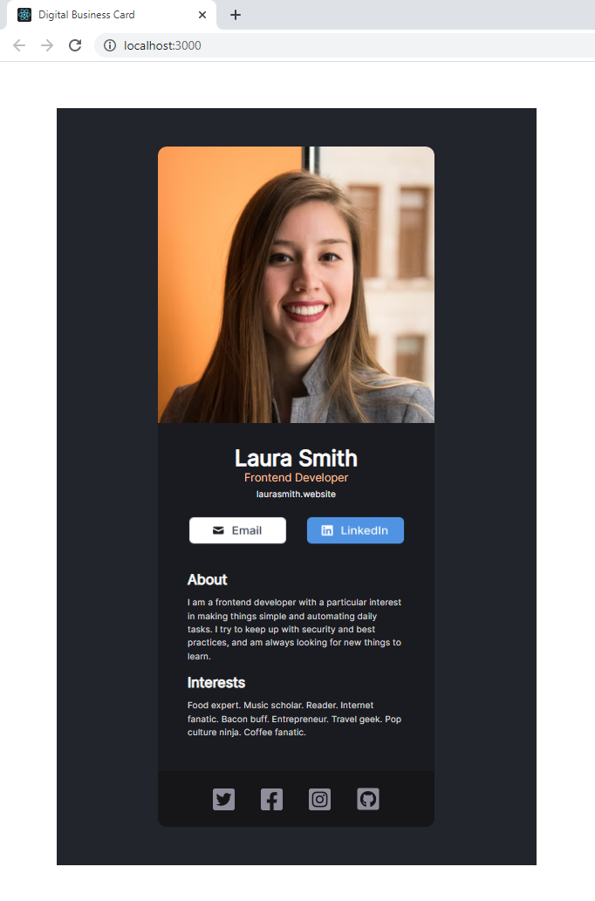

# Static React Business Card

This is a just a Solo Project idea/challenge from Scrimba.com. The challenge is to create a static/noninteractive react page that looks like one of the digital business cards found on Figma.com. This project was created locally using Create React App for bootstrapping (Scrimba encourages using their online environment).

* https://scrimba.com/learn/learnreact/
* https://www.figma.com/file/4ctPLUvIn5b5Ep6YPOZWWd/Digital-Business-Card?node-id=0%3A1
* This project was bootstrapped with [Create React App](https://github.com/facebook/create-react-app).

#

Screenshot of development build below:

 

